# ETL pipeline with CDC 

## Architecture Overview

This document details the ETL pipeline architecture across five main components:

1. **Source Database** - MongoDB for data storage
2. **Change Data Capture (CDC)** - Real-time change detection
3. **Message Queue** - RabbitMQ buffering system
4. **Data Processing** - Spark transformation layer
5. **Data Warehouse Sink** - Remote warehouse loading

---


## Architecture Diagram

```mermaid
graph LR
    Script[Timed Script<br/>DB Entry Simulator] -->|Insert Data| DB
    
    subgraph Container 1
        DB[(MongoDB)]
    end
    
    subgraph Container 2 - Producer
        CDC[Change Stream CDC]
        Cursor[Cursor]
        Threads[Threads]
        DB --> CDC
        CDC --> Cursor
        Cursor --> Threads
    end
    
    subgraph Container 3 - Buffer
        Exchange[RabbitMQ Exchange]
        Queue[Queue]
        Bindings[Bindings]
        Exchange --> Bindings
        Bindings --> Queue
    end
    
    subgraph Container 4 - Consumer
        Reader[Buffer Reader]
        Spark[Spark Transform]
        Loader[Data Warehouse Loader]
        Reader --> Spark
        Spark --> Loader
    end
    
    Threads -->|Publish| Exchange
    Queue -->|Consume| Reader
    Loader -->|Load| DW[Data Warehouse<br/>Remote]
    
    style DB fill:#47A248
    style Exchange fill:#FF6600
    style Queue fill:#FF6600
    style DW fill:#4A90E2
```


---

## 1. Source Database

### Technology
- **Database**: MongoDB

### Implementation Details

**Simulated Environment**
- A timed script runs locally to simulate production workload
- Generates INSERT and UPDATE operations for testing the ETL pipeline
- For this exercise it's assumed that a thrid party application is filling the database and that the data is validated before being inserted in the database, keeping data consistency.

**Data Structure**
- Single collection used for this challenge (Video analytics logs)
- Collection serves as the source for all CDC operations


## 2. Change Data Capture (CDC)

### Technology
- **CDC Method**: MongoDB Change Streams (Trigger-based)
- **Client**: Pika Python Client for RabbitMQ

### Implementation Details

**Change Stream Architecture**
- One cursor per collection monitoring the change stream
- Single collection = single cursor in this implementation
- Cursor iterates through data stream in real-time
- Each detected change (INSERT, UPDATE, DELETE) is immediately pushed to RabbitMQ

**Data Flow**
```python
MongoDB Change Stream → Cursor → Thread Pool → RabbitMQ (via Pika)
```

### Architectural Decisions

| Approach | Latency | DB Overhead | Scalability | Selected |
|----------|---------|-------------|-------------|----------|
| **Trigger-based** | Low (immediate) | High | Limited | ✓ |
| Log-based | Low (near real-time) | Low | High | - |
| Polling-based | High | Medium | Medium | - |


### Trade-offs

**Why Trigger-based for this Challenge:**
- ✓ Simplicity and fast implementation
- ✓ Immediate triggering on every change (lowest latency)
- ✓ Sufficient for development/testing environment
- ✗ High database overhead with volume
- ✗ Not suitable for production-scale systems

**Production Recommendation:**
Log-based CDC would be implemented for real-world deployment:
- Near real-time with low latency
- Reads transaction logs instead of triggering on operations
- Minimal database performance impact
- Better suited for high-velocity data streams


