# ETL pipeline with CDC 

## Architecture Overview

This document details the ETL pipeline architecture across five main components:

1. **Source Database** - MongoDB for data storage (In Mongo Atlas)
2. **Change Data Capture (CDC)** - Real-time change detection
3. **Message Queue** - RabbitMQ buffering system
4. **Data Processing** - Spark transformation layer
5. **Data Warehouse Sink** - Remote warehouse loading

---


## Architecture Diagram

```mermaid
graph LR
    Script[Timed Script<br/>DB Entry Simulator] -->|Insert Data| DB
    
    subgraph Container 1
        DB[(MongoDB)]
    end
    
    subgraph Container 2 - Producer
        CDC[Change Stream CDC]
        Cursor[Cursor]
        Threads[Threads]
        DB --> CDC
        CDC --> Cursor
        Cursor --> Threads
    end
    
    subgraph Container 3 - Buffer
        Exchange[RabbitMQ Exchange]
        Queue[Queue]
        Bindings[Bindings]
        Exchange --> Bindings
        Bindings --> Queue
    end
    
    subgraph Container 4 - Consumer
        Reader[Buffer Reader]
        Spark[Spark Transform]
        Loader[Data Warehouse Loader]
        Reader --> Spark
        Spark --> Loader
    end
    
    Threads -->|Publish| Exchange
    Queue -->|Consume| Reader
    Loader -->|Load| DW[Data Warehouse<br/>Remote]
    
    style DB fill:#47A248
    style Exchange fill:#FF6600
    style Queue fill:#FF6600
    style DW fill:#4A90E2
```


## Setup instruction

**Start services:**
```bash
docker compose up -d
```

**View logs:**
```bash
# All services
docker compose logs -f

# Specific service
docker compose logs -f producer
docker compose logs -f consumer
```

**Stop services:**
```bash
docker compose down
```

**Rebuild and restart:**
```bash
docker compose up -d --build
```

**Stop and remove volumes (clean slate):**
```bash
docker compose down -v
```

### Source Database
**Cloud (MongoDB Atlas)**
1. Create a database in MongoDB Atlas
2. Update the connection URI in `.env` or `producer/producer.py`
3. Replace the local database configuration with your Atlas connection string

### Simulate entries
1. After setting up your db
2. Run `python producer/db/data-simulation.py` (interval can be configured inside python script)

### Accessing Services
- RabbitMQ Management UI: http://localhost:15672 (guest/guest)
- ClickHouse HTTP: http://localhost:8123
- ClickHouse Native: localhost:9000

---
## 1. Source Database

### Technology
- **Database**: MongoDB

### Implementation Details

**Simulated Environment**
- A timed script runs locally to simulate production workload
- Generates INSERT, UPDATE and DELETE operations for testing the ETL pipeline
- For this exercise it's assumed that a third party application is filling the database and that the data is validated before being inserted in the database, keeping data consistency.

**Data Structure**
- Single collection used for this challenge (Video analytics logs)
- Collection serves as the source for all CDC operations


## 2. Change Data Capture (CDC)

### Technology
- **CDC Method**: MongoDB Change Streams (Trigger-based)
- **Client**: Pika Python Client for RabbitMQ

### Implementation Details

**Change Stream Architecture**
- One cursor per collection monitoring the change stream
- Single collection = single cursor in this implementation
- Cursor iterates through data stream in real-time
- Each detected change (INSERT, UPDATE, DELETE) is immediately pushed to RabbitMQ

**Data Flow**
```
MongoDB Change Stream → Cursor → Thread Pool → RabbitMQ (via Pika)
```

### Architectural Decisions

| Approach | Latency | DB Overhead | Scalability | Selected |
|----------|---------|-------------|-------------|----------|
| **Trigger-based** | Low (immediate) | High | Limited | ✓ |
| Log-based | Low (near real-time) | Low | High | - |
| Polling-based | High | Medium | Medium | - |

### Trade-offs

**Why Trigger-based for this Challenge:**
- ✓ Simplicity and fast implementation
- ✓ Immediate triggering on every change (lowest latency)
- ✗ High database overhead with volume
- ✗ Not suitable for production-scale systems

**Bottlenecks**
- For each message the RabbitMQ connection is created and closed. A singleton instance should be created to handle connections and channels.
- No batching implemented. Under high load individual message publish can become a bottleneck.
- I/O blocked on each publish. Should be done using a single thread per publish.

**Improvement Recommendations:**
- Implement log-based CDC for real-world deployment.
- Fix bottlenecks.
- Use Change Stream resume token to prevent data loss if the service crashes.

The producer creates a simple flow to publish messages to RabbitMQ. With more time some of the bottlenecks could have been fixed. Because this is my first time doing an ETL pipeline, significant time was spent doing research on how it's done and how each tool works.


## 3. Message Queue

### Technology
- **Queue System**: RabbitMQ

### Implementation Details

**Queue Configuration**
- Single queue named after the database collection
- One connection to RabbitMQ server
- **Delivery Guarantee**: At-least-once delivery
- Auto acknowledgement = False. Only acknowledge if the consumer processed the data without errors.

**Configuration Decisions:**
The system uses a single queue since there is only one collection to monitor. One connection to the RabbitMQ server is sufficient for the exercise scope, though multiple connections are supported. At-least-once delivery mode is configured to prevent any data loss.

**Message Flow**
```
Producer → RabbitMQ Connection → Queue (collection_name) → Consumer
```

### Trade-offs

**Delivery Guarantee Analysis**

| Mode | Data Loss Risk | Duplication Risk | Selected |
|------|----------------|------------------|----------|
| At-most-once | High | None | - |
| **At-least-once** | None | Possible | ✓ |
| Exactly-once | None | None | - |

**Design Priorities:**
1. **Prevent data loss** - Some data loss is acceptable for live analytics, but better avoided
2. **Prevent duplicate data in warehouse** - Ensure data quality in consumer
3. **No ordering** - FIFO, failed messages go back to the queue.

**Idempotency Considerations:**
- **Consumer idempotence**: May reprocess duplicates unnecessarily
- **Warehouse write idempotence**: Prevents duplicates from being written
- **Chosen approach**: Warehouse write idempotence for simplicity

**Trade-off Impact:**
This approach ensures no data loss but the consumer may spend extra time processing duplicate messages. As an improvement, idempotence would be added to both the consumer (to prevent reprocessing) and warehouse writes (to prevent duplicate storage). In live analytics workloads some small data loss is theoretically acceptable, but at-least-once delivery ensures data completeness while relying on warehouse-level deduplication.

To prevent data loss if the processing of a message fails in the consumer it will be requeued. For this simple exercise this was done to prevent information loss, however an alternative strategy should be used to prevent bottlenecks. Only after successfully processing and loading the manual acknowledgement is sent to the message queue.

This process is also single-threaded, it only processes one message at a time. It should be done with one thread per message.

> **Important!** If the analytics involve financial data, legal data or inventory management, data loss must be prevented at all costs. For this exercise our live analytics calculate watched ratio for every video.

No special ordering is used for this implementation. The data doesn't need to be processed in a specific order because the final outcome will be an aggregation operation. This means the order doesn't affect the final result.

**Bottlenecks**
- Failed messages are requeued, this can block the queue if the message processing keeps failing. To prevent this create a separate failed_messages queue to store after several failed attempts.

**Improvement Recommendations**
- Every producer should have its own channel. For this exercise there is only one consumer.
- Every consumer should have its own channel as well.
- Create a failed_messages queue to store failed data.


## 4. Data Processing

### Technology
- **Processing Framework**: Apache Beam
- **Queue Client**: Pika (Python)

### Implementation Details

**Consumer Architecture**
- Pika Client connects to RabbitMQ server
- Consumes from a single queue (one collection = one queue)
- Callback function triggered for each message event
- Client to Warehouse initialized in worker
- The pipeline is created and run per message

**Transformation Pipeline**
```
Message → Clean → Transform → Enrich → Load to Warehouse
```

**Data Enrichment**
Calculates video watch completion percentage:
```python
completion_rate = (watched_time / total_video_time) * 100
```

**Duplicate Handling**
- Consumer does not prevent reprocessing of duplicate messages
- Warehouse write method ensures no duplicate data insertion
- Trade-off: Consumer may reprocess duplicates but warehouse remains clean

### Architectural Decisions

**Pipeline**:
This pipeline is created for each message. Because it's called inside the callback function where each message is received. As a first exercise this was done to create a simple pipeline, however it's not efficient. As well the pipeline is run with a single message however Beam can handle batch processing which is more efficient.

**Operation Type**:
Only the write operation was implemented because of simplicity, however there is some example code of what it could look like to also soft delete a record in the data warehouse. Because it's assumed that no data will want to be deleted from the warehouse since it's used for analytics the option was not fully implemented.

**Processing Order**: 
No special ordering is implemented. Data doesn't need specific ordering because the final outcome is an aggregation operation, meaning order doesn't affect the final result.

**Idempotency Strategy**:
- **Current implementation**: Warehouse-level deduplication only
- **Production recommendation**: Add consumer-level idempotency to prevent unnecessary reprocessing and reduce compute overhead

**Data Quality**: 
Transformation includes cleaning and enrichment and transforms the data to match the data warehouse schema. In the warehouse schema a ReplicatedMergeTree was used to have a deduplication strategy. The default strategy was used where the chosen record is the last inserted. This was necessary because of the at-least-once strategy in the Message Queue where duplicates can be processed and rewritten into the warehouse.

**Bottlenecks**
- Creating the pipeline per message creates an overhead in the consumer.
- The requeue could cause a bottleneck because there is no failed_messages queue logic implemented.

**Improvements**
- Create a pipeline that is only used in the callback and not created in it.
- Use batch messaging to improve performance.


## 5. Data Warehouse

### Technology
- **Data Warehouse**: Clickhouse

### Implementation Details

**Architecture**
- Is a SQL database. Better for data analysis
- Database and tables are initialized whith the container
- ReplicationMergeTree strategy for deduplication (Explain in consumer)
- A simple schema was created to test the etl pipeline, however improvements need to be done to improve queryin on the data warehouse.

**Improvements**
- Modify Order BY and Primary Key to have more efficient querying.
- Create partitions to improve performance and mantainability.

---
## Development Notes

### Logging
Logging is implemented throughout the application to track pipeline progress. View real-time logs using:
```bash
docker compose logs -f [service_name]
```

### Known Limitations
**Error Handling**: Current implementation has basic error handling. Improvements needed:
- Retry logic for failed container connections on restart
- Connection resilience for initial service startup failures
- Enhanced error messages for easier debugging and maintenance

# Working example


