# ETL pipeline with CDC 

## Architecture Overview

This document details the ETL pipeline architecture across five main components:

1. **Source Database** - MongoDB for data storage
2. **Change Data Capture (CDC)** - Real-time change detection
3. **Message Queue** - RabbitMQ buffering system
4. **Data Processing** - Spark transformation layer
5. **Data Warehouse Sink** - Remote warehouse loading

---


## Architecture Diagram

```mermaid
graph LR
    Script[Timed Script<br/>DB Entry Simulator] -->|Insert Data| DB
    
    subgraph Container 1
        DB[(MongoDB)]
    end
    
    subgraph Container 2 - Producer
        CDC[Change Stream CDC]
        Cursor[Cursor]
        Threads[Threads]
        DB --> CDC
        CDC --> Cursor
        Cursor --> Threads
    end
    
    subgraph Container 3 - Buffer
        Exchange[RabbitMQ Exchange]
        Queue[Queue]
        Bindings[Bindings]
        Exchange --> Bindings
        Bindings --> Queue
    end
    
    subgraph Container 4 - Consumer
        Reader[Buffer Reader]
        Spark[Spark Transform]
        Loader[Data Warehouse Loader]
        Reader --> Spark
        Spark --> Loader
    end
    
    Threads -->|Publish| Exchange
    Queue -->|Consume| Reader
    Loader -->|Load| DW[Data Warehouse<br/>Remote]
    
    style DB fill:#47A248
    style Exchange fill:#FF6600
    style Queue fill:#FF6600
    style DW fill:#4A90E2
```


---

## 1. Source Database

### Technology
- **Database**: MongoDB

### Implementation Details

**Simulated Environment**
- A timed script runs locally to simulate production workload
- Generates INSERT and UPDATE operations for testing the ETL pipeline
- For this exercise it's assumed that a thrid party application is filling the database and that the data is validated before being inserted in the database, keeping data consistency.

**Data Structure**
- Single collection used for this challenge (Video analytics logs)
- Collection serves as the source for all CDC operations


## 2. Change Data Capture (CDC)

### Technology
- **CDC Method**: MongoDB Change Streams (Trigger-based)
- **Client**: Pika Python Client for RabbitMQ

### Implementation Details

**Change Stream Architecture**
- One cursor per collection monitoring the change stream
- Single collection = single cursor in this implementation
- Cursor iterates through data stream in real-time
- Each detected change (INSERT, UPDATE, DELETE) is immediately pushed to RabbitMQ

**Data Flow**
```python
MongoDB Change Stream → Cursor → Thread Pool → RabbitMQ (via Pika)
```

### Architectural Decisions

| Approach | Latency | DB Overhead | Scalability | Selected |
|----------|---------|-------------|-------------|----------|
| **Trigger-based** | Low (immediate) | High | Limited | ✓ |
| Log-based | Low (near real-time) | Low | High | - |
| Polling-based | High | Medium | Medium | - |


### Trade-offs

**Why Trigger-based for this Challenge:**
- ✓ Simplicity and fast implementation
- ✓ Immediate triggering on every change (lowest latency)
- ✓ Sufficient for development/testing environment
- ✗ High database overhead with volume
- ✗ Not suitable for production-scale systems

**Production Recommendation:**
Log-based CDC would be implemented for real-world deployment:
- Near real-time with low latency
- Reads transaction logs instead of triggering on operations
- Minimal database performance impact
- Better suited for high-velocity data streams

## 3. Message Queue

### Technology
- **Queue System**: RabbitMQ

### Implementation Details

**Queue Configuration**
- Single queue named after the database collection
- One connection to RabbitMQ server
- **Delivery Guarantee**: At-least-once delivery

**Configuration Decisions:**
The system uses a single queue since there is only one collection to monitor. One connection to the RabbitMQ server is sufficient for the exercise scope, though multiple connections are supported. At-least-once delivery mode is configured to prevent any data loss.

**Message Flow**
```python
Producer → RabbitMQ Connection → Queue (collection_name) → Consumer
```

### Trade-offs

**Delivery Guarantee Analysis**

| Mode | Data Loss Risk | Duplication Risk | Selected |
|------|----------------|------------------|----------|
| At-most-once | High | None | - |
| **At-least-once** | None | Possible | ✓ |
| Exactly-once | None | None | - |

**Design Priorities:**
1. **Prevent data loss** - Some data loss is acceptable for live analytics, but better avoided
2. **Prevent duplicate data in warehouse** - Ensure data quality in consumer
3. **No ordering** - FIFO, failed messgaes go back to the queue.

**Idempotency Considerations:**
- **Consumer idempotence**: May reprocess duplicates unnecessarily
- **Warehouse write idempotence**: Prevents duplicates from being written
- **Chosen approach**: Warehouse write idempotence for simplicity

**Trade-off Impact:**
This approach ensures no data loss but the consumer may spend extra time processing duplicate messages. As an improvement, idempotence would be added to both the consumer (to prevent reprocessing) and warehouse writes (to prevent duplicate storage). In live analytics workloads some small data loss is theoretically acceptable, but at-least-once delivery ensures data completeness while relying on warehouse-level deduplication.

> **Important!** If the analytics involve financial data, legal data or inventory management, data loss must be prevented at all costs. For this exercise our live analytics show something like: % of people who finished a video.

No special ordering is used for this implementation. The data doesn't need to be processed in a specific order because the final outcome will be an aggregation operation. This means the order doesn't affect the final result.


## 4. Data Processing

### Technology
- **Processing Framework**: Apache Beam
- **Queue Client**: Pika (Python)

### Implementation Details

**Consumer Architecture**
- Pika Client connects to RabbitMQ server
- Subscribes to single queue (one collection = one queue)
- Callback function triggered for each message event

**Transformation Pipeline**
```python
Message → Clean → Transform → Enrich → Load to Warehouse
```

**Data Enrichment**
Calculates video watch completion percentage:
```python
completion_rate = (watched_time / total_video_time) * 100
```

**Duplicate Handling**
- Consumer does not prevent reprocessing of duplicate messages
- Warehouse write method ensures no duplicate data insertion
- Trade-off: Consumer may reprocess duplicates but warehouse remains clean

### Architectural Decisions

**Processing Order**: 
No special ordering is implemented. Data doesn't need specific ordering because the final outcome is an aggregation operation, meaning order doesn't affect the final result.


**Idempotency Strategy**
- **Current implementation**: Warehouse-level deduplication only
- **Production recommendation**: Add consumer-level idempotency to prevent unnecessary reprocessing and reduce compute overhead


**Data Quality**: 
Transformation includes cleaning and enrichment and transforms the data to match the data warehouse schema.

